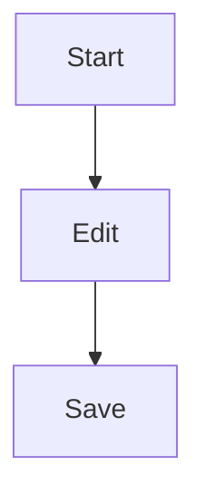

# Features

## Editing Experience

### WYSIWYG

- Real-time preview
- Instant rendering
- Smooth input
- Zero-latency response

### Syntax Support

#### Basic Markdown

```markdown
# Heading
**Bold** *Italic*
- List
[Link](url)

```

#### Extended Syntax

- Tables
- Task lists
- Footnotes
- Highlights
- Superscript/Subscript

#### Code Highlighting

Supports syntax highlighting for 100+ programming languages:

```javascript
function hello() {
  console.log('Hello, World!')
}
```

#### Math Formulas

Supports LaTeX math formulas:

```latex
$$
E = mc^2
$$
```

#### Diagrams

Supports Mermaid diagrams:



## File Management

### File Tree

- Hierarchical display
- Drag-and-drop sorting
- Quick navigation
- Favorites

### Search

- Filename search
- Content search
- Regular expressions
- Fuzzy matching

### Tags

- Custom tags
- Tag filtering
- Tag management
- Color coding

## Collaboration

### Version Control

- Git integration
- History records
- Diff comparison
- Rollback/restore

### Sharing

- Export HTML
- Generate PDF
- Share links
- Embed code

## Performance

### Fast Startup

- Second-level startup
- Lazy loading
- Incremental rendering

### Large File Support

- Virtual scrolling
- Chunked loading
- Streaming rendering
