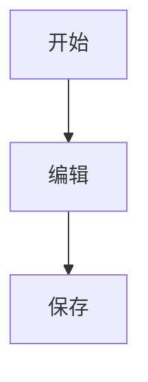

# 功能特性

## 编辑体验

### 所见即所得

- 实时预览
- 即时渲染
- 流畅输入
- 无延迟响应

### 语法支持

#### 基础Markdown

```markdown
# 标题
**粗体** *斜体*
- 列表
[链接](url)

```

#### 扩展语法

- 表格
- 任务列表
- 脚注
- 高亮
- 上下标

#### 代码高亮

支持100+编程语言的语法高亮：

```javascript
function hello() {
  console.log('Hello, World!')
}
```

#### 数学公式

支持LaTeX数学公式：

```latex
$$
E = mc^2
$$
```

#### 图表

支持Mermaid图表：



## 文件管理

### 文件树

- 层级展示
- 拖拽排序
- 快速导航
- 收藏夹

### 搜索

- 文件名搜索
- 内容搜索
- 正则表达式
- 模糊匹配

### 标签

- 自定义标签
- 标签过滤
- 标签管理
- 颜色标记

## 协作功能

### 版本控制

- Git集成
- 历史记录
- 差异对比
- 回滚恢复

### 分享

- 导出HTML
- 生成PDF
- 分享链接
- 嵌入代码

## 性能

### 快速启动

- 秒级启动
- 懒加载
- 增量渲染

### 大文件支持

- 虚拟滚动
- 分块加载
- 流式渲染
